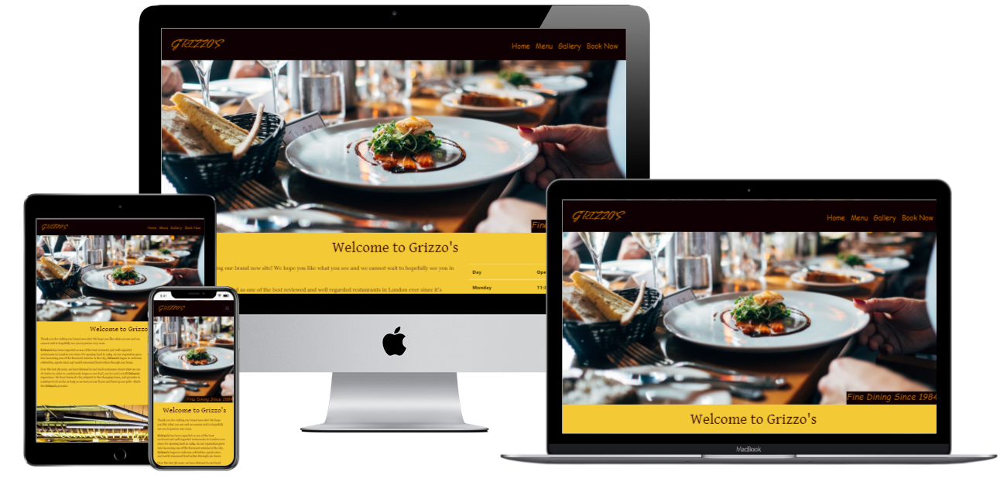

# Grizzo's Restaurant README
Here is a link to the website [Grizzo's](https://8000-alikariminik-milestonepr-uuir1y00e8j.ws-eu27.gitpod.io/index.html)

## What is this ReadME for?
This is the ReadMe for the website for the fictional London-based Restaurant called Grizzo's. It is designed to entice  potential customers enough to make a booking through the use of its various menus and images across a easily navigavle website. The website aims to be responsive and accessibile on a range of devices, making it easy to navigate for customers.

## The Five Planes
### The Strategy Plane
The purpose of this website is to advertise a local restaurant and attract customers to dine here. Before designing the website, it was important to keep this in mind. I knew that when enquiring about a restaurant, customers need a website which is clear, enticing, and easy to navigate quickly. Therefore I thought it was important to feature the restaurant's business hours in a way which was clearly visible and as one of the first things customers would see, a clear menu section, and a gallery page;filled with lots of beautiful images. As part of my research into what makes a good restaurant, I browsed the websites of restaurants I had visited throughout my life to try to draw inspiration.

### The Scope Plane
I have included the following features in my website:
* 4 complete pages, which are easy to navigate between, plus 4 pdf files;
* a Gallery page with maisonette image viewing structure;
* An interactive Menu Section which reacts to being hovered over and triggers the download of pdfs rather than navigatingto further into the website itself, so that it is always easy for customers to know where to book a reservation when they decise that they want to.
* A Booking Form which contains names, emails, date & times.

### The Structure Plane
My website has 4 pages, and I created Wireframes for them by hand, which I have attached here:

[wireframes-home-monitor](assets/wireframes/home-monitor-wireframe.jpg)
[wireframes-home-tablet](assets/wireframes/home-tablet-wireframe.jpg)
[wireframes-home-mobile](assets/wireframes/home-mobile-wireframe.jpg)
[wireframes-menu-monitor](assets/wireframes/menu-monitor-wireframe.jpg)
[wireframes-menu-tablet](assets/wireframes/menu-tablet-wireframe.jpg)
[wireframes-menu-mobile](assets/wireframes/menu-mobile-wireframe.jpg)
[wireframes-gallery-monitor](assets/wireframes/gallery-monitor-wireframe.jpg)
[wireframes-gallery-tablet](assets/wireframes/gallery-tablet-wireframe.jpg)
[wireframes-gallery-mobile](assets/wireframes/gallery-monbile-wireframe.jpg)
[wireframes-book-monitor](assets/wireframes/book-monitor-wireframe.jpg)
[wireframes-book-tablet](assets/wireframes/book-tablet-wireframe.jpg)
[wireframes-book-mobile]((assets/wireframes/book-mobile-wireframe.jpg))

I have structured each website as follows:

##### Navigation and Footer
The Nav bar hosts links to all the websites pages and is stuck to the top so that the user can always open any of the other pages on the website, wherever they currently are on the screen. Additionally, the nav bar has a collapsable drop-down menu / burger icon which displays on smaller screens. This results in less real estate being taken up on small screens but also maintains the goal purpose of the navbar which was to ensure site-wide navigation is only a couple taps / clicks away.  

The footer hosts contact information, the restaurant's address and links to social media pages in the form of Font-Awesome Icons. This facilitates for the footer to take up a small amount real estate. 

#### Home Page
I wanted the home page to show a large hero image which quickly conveys what Grizzo's is all about. Fine Dining. All the key information about the restaurant can be found in this page and the nav bar allows for quick access to making a booking.

#### Menu Page
The Menu page was designed in this way to boast the variety of menus that Grizzo's has to offer. Opting for a inline-block display, the menus are eye catching, clickable to download, and host importan information for when each item is available to order throughout the week. The background images are bright and showcase more examples of delicious looking food that the individual is made to engage with by clicking on the overlay over them. 

#### Gallery Page
The whole point of this page was to display several really bright and colourful images in a way which is enticing to customers. I opted for a maisonette viewing structure for this page at the top of the page in order to make the images the central focus on this page. I know images are important for a website, so this page was really about giving customers access to feast their eyes before booking.

#### Booking page
The booking page was designed to be very simple and easy to use regardless of screensize. This is what ultimately gets bookings into the restaurant so simplicity was key here.

### The Skeleton Plane
I created my website with a mobile first experience in mind, because the majority of booking reservations are now made following a google search etc, usually on our phones. I have ensured that my website works effectively and looks beautiful on each sized device. 

My website focused on a mobile first experience, but I ensured that my website would create a positive user experience on all devices.

#### The Surface Plane
I have used the following colors throughout my website:
(yellow colour) made up the bulk of my website, and was chosen because it is warm and inviting. 

(brown color) As it was important that my website had a warm feel which would reflect the experience of being at the restaurant, I felt that greys and blacks were too cool toned to fit within my design. I therefore opted to offset my yellow background and images with a chocolatey brown. 

I have used several images throuhgout my website, which really pop against these colours and are very effective. I browsed the content on the following sites:
* Pexels
* Unsplash
* StockVault

Exact links to the specific images can be found below in the 'Credit' section.

## User Experience (UX)
When beginning to think about what a website for a restaurant would require, I began by thinking about the business needs and the customer / user needs.

 -   #### Customer Goals
    - Immediately understand what the website is trying to offer.
    - Easily be able to navigate the various pages on the site. 
    - Be able to access the site on a range of devices. 
    - Quickly find key business information such as Business Times, Location, Contact details etc.

 -   #### Business Goals
    - Showcase an attractive and user-friendly / navigable site. 
    - Inform the customer what's on offer through the use of downloadable menus.
    - Allow for users on all devices to access the page without issue.
    - Provide key information that customers may want before deciding to book or not as menus, business hours, location, images.

-   ### User stories

    -   #### First Time Visitor Goals

        1. As a First Time Visitor, I want to quickly understand the main purpose of the site.
        2. As a First Time Visitor, I want to be able to easily navigate throughout the site to find content. Key information such as Location, Contact Details and Business Hours should be easily findable. 
        3. As a First Time Visitor, I want to see their menus, decide on whether there is anything I would like to have their, and if so, be able to book a table quickly and easily.

        #### Returninng Visitor Goals

        1. As a Returning Visitor, I want to be able to very quickly find how to book a table or if already have a booking, find a contact number in case the customer needed to speak to a member of the team.
    

-   ### Design
    -   #### Colour Scheme
        -   The Four main colours used are various shades of Yellow, Orange, White and Black. I have mainly avoided using absolute colours as I found these to be too harsh for the style I wanted to achieve. I decided on a color palette with the use of [Coolors]https://coolors.co/7a7978-87cbac-1d1a05-ffd07b-fdb833  
    -   #### Typography
        -   I used the  'Smooch' font for the Logo with 'Cursive' as the fallback font in case for any reason the font isn't being imported into the site correctly. I found 'Smooch' through Google Fonts and I felt as though this font; when displaying the name of the restaurant "Grizzo's"; gave a clear legible signature-like look to the site which I felt gave the feeling of a real restaurant.
        - Cursive was used on the Nav Bar as it produced a clean and legible output which is I thought was key for a Nav Bar.
        - 'Gentium Book Basic' was used as Headings across the various site pages to ensure legibility consistency, with Sans-Serif used as a fallback font.

    -   #### Imagery
        -   Images over text. When someone visits a restaurant's website, they want to imagine themselves in that restaurant prior to going so that they know what they are potentially going to be spending a signifcant amount of money for. That is why the first thing you see when you access the page is a large back-ground hero image which showcases some of the elegant, eye-catching food that Grizzo's has to offer. This hero-image inconjunction with the the large image of the restaurant itself at the bottom of the Home page capture everything about this restaurant - delicious and elegant looking food in a beautiful, colourful environment.

    ### Wire Frames
    All [Wireframes](/workspace/Milestone-Project-One/assets/wireframes) can be viewed here.

    Wireframes for my 4 pages (3screen-sizes each = 12 total) can be found via the link above or by accessing the 'wireframes' folder in 'assets'.

    These wireframes, although drawn by hand, provided me with a guide as to how each page should look per each of the common screen sizes. The wireframes weren't stuck to exactly - most noticably with the decision to go for 2 menu blocks in a row on the 'menu' page, rather than all of them inline. All through-out the development process, I experimented with various designs for differents areas of my page to see what looked good and what didn't; and also to further develop my understanding of what properties caused what outcomes.

-   ## Features

    - ###  Existing Features
        -   Responsive Elements
        -   Booking Form
        -   Gallery which showcases food, interior of the restaurant such as: tables, bar etc.
        -   Table of Business Hours
        -   Downloadable menus
        -   NavBar with Responsive 'Burger Icon'
        -   Interactive elements - Hover.

    - ###   Features Which I Would Have Liked to Utilise
        -   Scrolling Gallery
        -   Google Maps Box displaying Restaurant Location.

-   ## Technologies Used

### Languages Used

-   [HTML5](https://en.wikipedia.org/wiki/HTML5)
-   [CSS3](https://en.wikipedia.org/wiki/Cascading_Style_Sheets)

### Frameworks, Libraries & Programs Used

-   [Bootstrap 4.4.1:](https://getbootstrap.com/docs/4.4/getting-started/introduction/)
    - Bootstrap was used to assist with the responsiveness and styling of the website. In particular Bootstrap was useful for designing a responsive and tidy looking footer.
-   [Hover.css:](https://ianlunn.github.io/Hover/)
    - Hover.css was used on the Social Media icons in the footer to add a contrasting color while being hovered over. This was also used in the navbar when hovering over a page link and the logo.
-   [Google Fonts:](https://fonts.google.com/)
    - Google fonts were used to import the 'Smooch' & 'Gentium' font into the style.css file which is used on throughout the pages of project - further details in Design > Typography section of this file.
-   [Font Awesome:](https://fontawesome.com/)
    - Font Awesome was used in the footer to add icons for which harbored links to the restaurant's false Social Media Pages (Links directed to the actual Social Media Homepage rather than any restaurant Social Media page). The Font Awesome Icons themselves were also added for aesthetic and UX purposes.
-   [Git](https://git-scm.com/)
    - Git was used for version control by utilizing the Gitpod terminal to commit to Git and Push to GitHub.
-   [GitHub:](https://github.com/)
    - GitHub is used to store the projects code after being pushed from Git.

## Testing

### Testing User Stories from User Experience (UX) Section

-   #### First Time Visitor Goals

    1. As a First Time Visitor, I want to quickly understand the main purpose of the site.
            - Immediately when the site loads, you are greeted with the nav bar, hero image and the hero image text overlay. The combination of all 3 (primariliy hero image and hero image text overlay) convey the message that this is a fine dining restaurant. 

    2.  As a First Time Visitor, I want to be able to easily navigate throughout the site to find content. Other information such as Location, Contact Details and Business Hours should be easily findable. 
            - The Nav bar is visible straight away and the navigation destinations are clearly defined  through their titles on the nav bar: Menu directs the user to the menus, Gallery to the photos of the restaurant and Book Now to the booking form.
            - Location, Contact Details and Business Hours can all be found on the Home Page. However, on review, I feel as though this information should be included on a seperate page as well as in the footer just incase there are some users who are unaware to check the nav bar. This is something to remember for future projects.
    3.   As a First Time Visitor, I want to see their menus, decide on whether there is anything I would like to have their, and if so, be able to book a table quickly and easily.
            - As mentioned above, the menus and booking form are included in the nav bar which allows for quick and easy navigation. 

### Validators

The W3C Markup Validator and W3C CSS Validator Services were used to validate every page of the project to ensure there were no syntax errors in the project.

* [W3C HTML Validator](https://validator.w3.org/nu/) 
    -   index.html: Needed to change "alt" to "title" to correctly give alternative text to images which were backgrounds of divs. There were 2 occurences of this.
    -   index.html: [script] was not included within the body. Moved into the bottom of the body.

    -   menu.html: Needed to change "alt" to "title" to correctly give alternative text to images which were backgrounds of divs. There were 4 occurences of this.
    -   menu.html: [script] was not included within the body. Moved into the bottom of the body.
    -   menu.html: Element h3 & h5 not allowed as child of element span in this context. Changed these Spans to Divs to overcome this error. Then  added IDs to these Divs which targetted their heights and widths (overiding "menu-blocks div" height and width which were causing responsiveness issues) Result was a better responsive text-overlay which sat in the center of the images regardless at whatever screen size.

    -   gallery.html: Section lacks heading. Changed Section to Div.
    -   gallery.html: [script] was not included within the body. Moved into the bottom of the body.

    -   booking.html: No space between attributes. 2 occurences.
    -   booking.html: The element button must not appear as a descendant of the a element. Removed.
    -   booking.html:Attribute placeholder is only allowed when the input type is email, number, password, search, tel, text, or url. Removed placeholder.
    -   booking.html:Attribute placeholder is only allowed when the input type is email, number, password, search, tel, text, or url. Removed placeholder.
    -   booking.html: Bad value 23/01/2022 for attribute min on element input. Removed.

*   [W3C CSS Validator](https://jigsaw.w3.org/css-validator/#validate_by_input) - 
    -  No Errors Found.

### Responsiveness

Vigorous testing was conducted throughout the development process to ensure that all pages maintained responsiveness as more elements were added on. Using developer tools and adjusting screen dimensions, I have checked to ensure that all content displays clearly over a varierty of screen sizes - primarily on the Mobile, Tablet and Monitors.

#### Resolved Issues
One major difficulty I had during this development of this website was on the menu page. Setting the text-overlay over the dead center of the image proved to more challenging that initially thought and this took between 2-3 hours of trial and error to resolve. Eventually, I found a CSS code online which managed to get the overlay to position exactly where I want it.

Links to the websites which helped resolve this issues can be found in the Credit section below.

#### Known Bugs
There is one bug which I have not been able to resolve and that is with the image of the restaurant at the bottom of the home page, just above the footer. On smaller screen sizes, only the top 20-30% of the image shows which cuts out a lot of its meaningful imagery. If I had more time, I would spend longer to resolve this. However, as a work around for now, the image has been included on the gallery page where the full image can be seen on all screen sizes.

## Deployment
- To deploy the website, I followed the below steps on GitHub. 
1. Go to "Settings" on the repository 
2. On "Source" of "GitHub Pages"  
3. Select "Master" for Branch and click 'Save' 
4. The website is now published on GitHub Pages and the link is provided in the same section

## Credit

#### Resources 
- Code Institute course material
- Code Institute Mentor
- [CodeInstitute-ReadME](https://github.com/Code-Institute-Solutions/SampleREADME)

#### Code
https://www.smashingmagazine.com/2013/08/absolute-horizontal-vertical-centering-css/ - Stephen Shaw
https://css-tricks.com/quick-css-trick-how-to-center-an-object-exactly-in-the-center/ - Chris Coyier
 - A combination of these two webpages together provided me with CSS code that proved to be extremely helpful in allowing me to position the menu-text-overlay in the dead center of the menu image blocks.

 #### Media
 - [bartender.jpg] https://unsplash.com/photos/Iutgnhkdh2g Andrew C Taylor Jr
 - [delivering-order.jpg] https://mystock.themeisle.com/photo/fancy-restaurant/ Cristian Ungureanu
 - [dinner-overlay.jpg] https://unsplash.com/photos/NYBnDWeOX2c Loija Nguyen
 - [food-platter.jpg] https://www.pexels.com/photo/food-wood-art-winter-5975427/ Eva Elijas
 - [happy-bar.jpg] https://unsplash.com/photos/GqC_kGJOuaM Elevate
 - [happy-family.jpg] https://unsplash.com/photos/wYOPqmtDD0w Pablo Merchan Montes
 - [hero-image.jpg] https://unsplash.com/photos/N_Y88TWmGwA Jay Wennington
 - [kitchen-work.jpg] https://pxhere.com/en/photo/1327589
 - [lunch-overlay.jpg] https://unsplash.dogedoge.com/photos/pCxJvSeSB5A Monika Grabkowska
 - [salmon-and-wine.jpg] https://unsplash.com/photos/awj7sRviVXo Casey Lee
 - [steak.jpg] https://pixabay.com/photos/food-steak-meat-soup-beef-bbq-3676793/ Gurkanerol
 - [sundary-roast.jpg] https://unsplash.com/photos/VqTwBiaiSsk Lisa Baker
 - [veg-bowl.jpg] https://unsplash.com/photos/IGfIGP5ONV0 Anna Pelzer
 - [veg-vegan-overlay.img] https://unsplash.com/photos/t25uzcDm7fQ Farhad Ibrahimzade